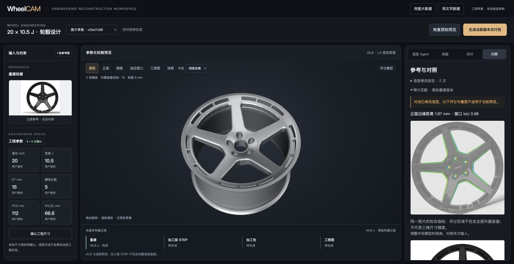
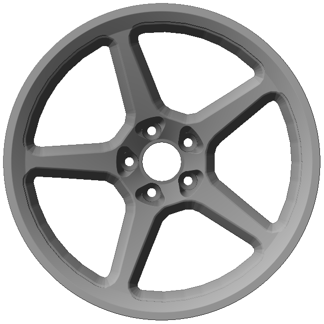
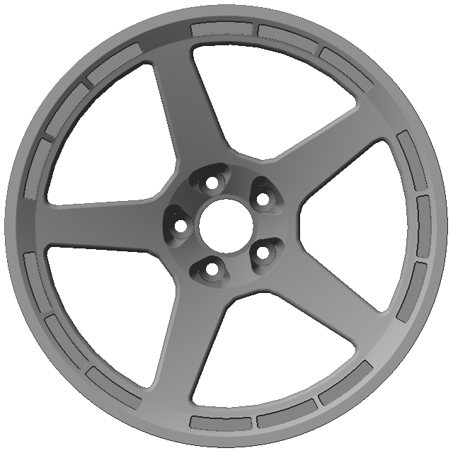
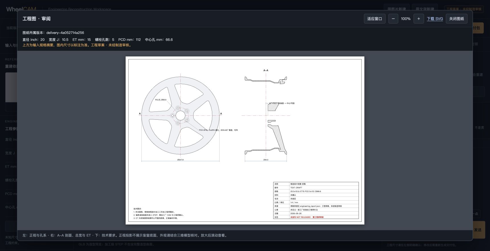
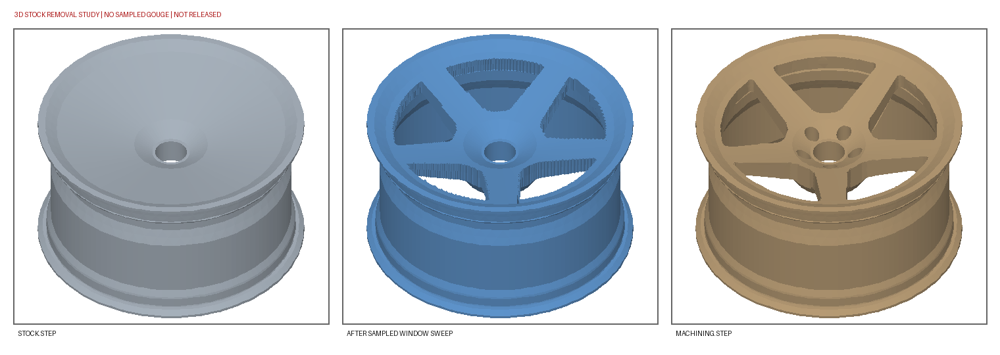

# Wheel Engineering Agent

**VortoTech · 从轮毂参考与工程需求，到可调整、可追溯的 CAD 草稿。**

输入轮毂照片或文字需求，补充已知尺寸，通过 **Wheel Engineering Skill** 理解结构、记录未知、生成配方、构建模型并检查结果。工程师可以在工作台中持续对话修改造型、查看渲染，再生成当前版本的工程交付草案。

[产品全貌：架构 · 当前 PRD · 路线图](docs/product-architecture-roadmap.md) · [技能入口](skills/wheel-engineering/SKILL.md) · [安装说明](skills/wheel-engineering/references/setup.md) · [架构说明](docs/architecture.md) · [Spark 实测](docs/workbench-hardening.md)

## 产品核心与方向

核心是 **Wheel Engineering Skill 中的工程约束与证据层**：把模型建议转成受控配方，保留尺寸来源和未知项，构建几何并验证实际产物。当前工作台支持图片／文字新建、造型对话、版本检查与工程交付草案；LocalPilot 是可选的模型部署衔接。

当前重点是做深轮毂闭环：**共享工程约束 → 完整造型 STEP 稳定性 → 独立新款验收 → 工程师修正数据**。多品类 Skill、CAE 与制造优化属于后续规划。

查看 [产品全貌与发展路线](docs/product-architecture-roadmap.md)，了解当前 PRD、三条几何路线的区别、已有证据，以及各阶段的验收门槛。

## 产品与效果

### 工程工作台



左侧保留输入与工程尺寸，中间查看三维模型，右侧进行造型对话、校验和版本对照。图为真实本机工作台截图（模型服务在 Spark、CAD 在 Mac）；对话修改后，界面会提示旧照片评分已过期。截图中的旧名称 WheelCAM 对应本项目现有界面。

### 造型 Agent 修正前后

| 初始预设 | Agent 修正后 |
| :---: | :---: |
|  |  |
| 外圈盲窗 0 个；斜面宽 16 mm、深 22 mm | 外圈盲窗 15 个；斜面宽 4 mm、深 6 mm |

两张图来自同一次 Spark 造型 Agent 运行。Agent 根据参考图调整预设造型，保持已提供的工程尺寸不变；修正后的 GLB 仍是 **L0 视觉草稿**，不代表完整造型 STEP 已构建。原始记录见 [Spark 复测摘要](docs/evidence/workbench-hardening-20260928.json)。

### 工程图审阅



工作台支持放大审阅、查看图纸所属版本与导出 SVG。图为独立的本机交付版本，包含正视图、A–A 剖面、孔系尺寸与技术要求；它不是工厂原始图纸，也未经过制造审核。

### 加工准备与采样仿真



从左到右为 `stock.step` 毛坯、采样窗口粗加工结果、`machining.step` 目标零件。该次运行在 1.5 mm 栅格下未发现相对加工级 STEP 的新增采样过切，剩余约 **0.467 L** 待精加工。加工级几何已简化，此结果不包含完整机床、刀柄与夹具碰撞验证。

## 已取得的验证结果

以下为 **2026-09-28 的已记录运行**，不是新款泛化保证或当前机器的实时状态。

| 项目 | 已记录结果 | 证据范围 |
| --- | --- | --- |
| Spark 端到端链路 | **5/5 步完成，57.7 s** | 一款 M59 开发案例；重建、加工 STEP、加工包、SVG 工程图、参考对照；本次未生成 PDF |
| 预览检查 | **6/6 通过** | 单实体、外径、总宽、孔系、ET、对称性；仅代表对应检查覆盖范围 |
| 加工级 STEP | 有效单实体、STEP 回读通过 | 简化加工几何，不含全部造型曲面 |
| 参考 CAD 对照 | 外径残差 **0.00 mm**；总宽残差 **−0.26 mm** | 该款参与过模板标定，不能解释为独立测试精度 |
| 三组开发集对照 | Skill 与 Skill＋造型 Agent 两组各 **4/4** 输出有效 STEP；通用受限基线 **0/4** | 两款 × 完整／缺 ET 四场景，预算和工具能力不同，不能归结为普遍质量优势 |
| Skill 可移植性 | 独立复制后可检查环境并调用真实照片理解流程 | 不代表已在全新节点验证完整安装与 CAD 全链 |

详见 [完整复测记录](docs/workbench-hardening.md)、[三组对照协议与结果](docs/skill-comparison-results.md)。图片来源与文件校验值见 [素材清单](docs/assets/readme/provenance.json)。

## 能做什么

| 能力 | 当前实现 |
| --- | --- |
| 图片建模 | 正面照片、可选斜视照片与已知规格 → 结构候选、配方和模型草稿 |
| 文字建模 | 自然语言需求 → 支持的轮毂模板、参数审查和预览 |
| 对话调整 | 修改允许的造型参数，重新建模和校验；工程尺寸单独确认 |
| 视觉核对 | 可选视觉 Agent 修正预设造型，并用渲染与参考图比较 |
| 工程验证 | 记录参数来源、未知项、几何检查、STEP 回读及未完成工序 |
| 交付准备 | 按选定配方生成加工级 STEP、工程图、参考 NC 和采样仿真 |

**当前定位：工程师的建模与审核助手。** 输出保持 `not_released`；复杂造型、结构强度和制造可行性仍需进一步验证。

## 核心：Wheel Engineering Skill

Skill 将轮毂专业规则组织成可复用的工作流程：

```text
Understand     Reason        Reconstruct      Verify        Report
理解输入   →   区分已知未知  →  配方与建模   →  检查结果   →  证据与交付状态
                                  ↑
                            工程师对话修改
```

它负责约束模型的建议：哪些尺寸必须由用户或图纸提供、哪些造型可以调整、如何重建、检查什么，以及哪些结论尚不能成立。

### 独立技能包

```text
skills/wheel-engineering/
├── SKILL.md                  使用契约与任务流程
├── scripts/
│   └── run.py                环境检查与统一调用入口
└── references/
    ├── setup.md              安装及模型配置
    ├── contracts.md          输入、产物与验收边界
    └── evaluation.md         评测方法
```

**整个目录可以单独安装到其他助手或项目中。** 包内包含说明、调用脚本和参考文档；建模引擎及依赖由独立安装的项目运行环境提供。

工作台调用 `services/wheelcam/` 中的 Python 实现。开发助手读取 `SKILL.md` 后，通过调用入口使用同一套能力。项目中的 `.agents/skills/wheel-engineering` 与 `.claude/skills/wheel-engineering` 均链接到这个技能目录；根目录 `SKILL.md` 保留为兼容入口。维护时只修改 `skills/wheel-engineering/`。

## 快速开始

以下命令适用于 macOS / Linux Shell。需要 Python 3.12 或 3.13、Git 和 `uv`；私有仓库需要访问权限。

### 1. 安装运行环境

```bash
git clone https://github.com/VortoTech/wheel-engineering-agent.git
cd wheel-engineering-agent
uv sync --locked --no-dev

export WHEEL_ENGINEERING_RUNTIME="$PWD"
python3 skills/wheel-engineering/scripts/run.py doctor
```

`doctor` 检查运行环境能否导入所需模块，不代表模型服务连通或建模结果已通过验证。

### 2. 用图片开始

准备自己的轮毂正面照片。先生成理解报告与配方：

```bash
python3 skills/wheel-engineering/scripts/run.py photo \
  --front /path/to/front.jpg \
  --spec '{"diameter_in":20,"width_in":10.5,"pcd_mm":112,"bolts":5,"center_bore_mm":66.6,"et_mm":15}' \
  --no-build --out runs/photo-understanding
```

以上尺寸只是调用示例，应替换成实际已知规格。使用 `--spec-evidence` 记录来源，详见 [输入与验收契约](skills/wheel-engineering/references/contracts.md)。

移除 `--no-build`、加入 `--kernel mesh --visual-check`，并换一个输出目录，即可构建和对照网格预览。需要完整造型 STEP 候选时选择 `--kernel brep`；复杂造型可能失败或跳过工序，应以报告为准。

### 3. 用文字开始

先配置兼容的对话模型服务，再执行：

```bash
export WHEELCAM_CHAT_BASE_URL=http://127.0.0.1:8000/v1
export WHEELCAM_CHAT_MODEL=your-model-id

python3 skills/wheel-engineering/scripts/run.py text \
  '五辐轮毂，20×10.5，ET15，5×112，中心孔66.6毫米' \
  --out runs/text-preview
```

需要鉴权时通过环境变量设置 `WHEELCAM_CHAT_API_KEY`。视觉 Agent 的模型配置见 [安装说明](skills/wheel-engineering/references/setup.md)。调用脚本不会自动读取 `.env` 或部署模型。

### 4. 打开工作台

在已配置模型的同一终端运行：

```bash
PYTHONPATH=services .venv/bin/python -m wheelcam.workbench \
  --runs runs/demo --port 8795
```

访问 **<http://127.0.0.1:8795>**，使用“用图片新建”或“用文字新建”。工作台按 `--runs` 指定目录保存和发现任务；首次启动没有预置的私人案例。

## 在其他项目中复用 Skill

1. 安装上面的建模运行环境。
2. 将 **整个** `skills/wheel-engineering/` 目录复制到助手的技能目录，例如 `~/.codex/skills/` 或 `~/.claude/skills/`；已有安装先检查再替换。
3. 设置 `WHEEL_ENGINEERING_RUNTIME` 为运行环境的绝对路径。
4. 调用安装目录中的脚本，或让助手使用 `wheel-engineering` 技能。

```bash
export WHEEL_ENGINEERING_RUNTIME=/absolute/path/to/wheel-engineering-agent
python3 /absolute/path/to/installed/wheel-engineering/scripts/run.py doctor
python3 /absolute/path/to/installed/wheel-engineering/scripts/run.py photo --help
```

输入与输出路径按调用者当前目录解释。输出必须是新目录或空目录。建议技能包与运行环境使用同一提交版本。完整说明见 [setup.md](skills/wheel-engineering/references/setup.md)。

## 架构与产物

```text
工作台 / 开发助手 / 命令行
            ↓
Wheel Engineering Skill
输入理解 · 参数来源 · 未知项 · 造型修改 · 验证规则
            ↓
Python 运行环境：配方 → 网格 / B-Rep → 检查与报告
            ↓
选定配方 → 加工级 STEP → 工程图 / 加工准备 / 采样仿真
```

| 产物 | 用途与边界 |
| --- | --- |
| `recipe.json` | 参数化重建配方，可用于修改和重新生成 |
| GLB | 快速造型预览，准备等级为 L0 |
| 完整造型 STEP 候选 | 来自 B-Rep 路径，需检查有效实体、回读和跳过工序 |
| `stock.step`、`machining.step` | 简化的加工毛坯与零件，未包含全部造型曲面 |
| 工程图、参考 NC、仿真图 | 工程交接与加工准备草案，尚未制造批准 |
| 报告与交付清单 | 参数来源、检查、失败、版本和产物追溯 |

STEP 不携带本项目的原生参数化特征历史，参数编辑通过配方重建完成。修改预览后，需要重新生成对应版本的交付包。

### 目录导航

| 目录 | 责任 |
| --- | --- |
| `skills/` | 可安装的技能包 |
| `services/wheelcam/` | 工作台、技能实现、几何与验证模块 |
| `scripts/` | 全链编排、启动及评测工具 |
| `tests/` | 行为、工程约束与隐私测试 |
| `docs/` | 架构、PRD、运行证据和历史记录 |
| `demo-video/` | 演示视频源码 |
| `experiments/` | 研究与评测实验 |
| `apps/web/` | 较早的界面；当前演示工作台使用 `workbench.html` |

Python 包名 `wheelcam` 与 `WHEELCAM_*` 环境变量保留兼容现有部署。详细模块职责见 [架构说明](docs/architecture.md)。

## 可选接入：LocalPilot

[`skills/localpilot/`](skills/localpilot/SKILL.md) 是轻量接入技能，引用 LocalPilot 上游 `local-ai-autopilot` 工作流。它帮助检查节点前置条件、取得模型端点，再交给 Wheel Engineering 使用；已有模型服务时可直接跳过 LocalPilot。

```text
LocalPilot 配置与评测 → 实际推理引擎端点 → Wheel Engineering Skill
```

提供的端点检查工具只验证模型发现与可选文字请求，不自动部署、不切换现有服务，也不把文字探测当作视觉或轮毂验收。全新节点仍需先准备驱动、推理引擎、LocalPilot CLI 等基础环境。详见 [接入与新节点说明](skills/localpilot/references/setup.md)。

## DGX Spark 运行背景

DGX Spark 承担本项目的本地模型推理与整链执行验证。图片、规格、模型调用和 CAD 产物可以在同一节点内处理；实际是否保持本地取决于模型端点配置。现有链路使用 StepFun 视觉语言模型和 NVIDIA vLLM 容器，几何构建由独立 ARM64 应用环境执行。

### 已核对的环境

以下为 **2026-09-28 实机只读检查**；环境清单见 [可复核记录](docs/evidence/spark-environment-20260928.json)。

| 层级 | 实际环境 |
| --- | --- |
| 硬件 | NVIDIA GB10；ARM64 / `aarch64`；系统报告约 119 GiB 内存 |
| 操作系统与驱动 | Ubuntu 24.04.3 LTS；NVIDIA 驱动 `580.82.09` |
| 推理容器 | `nvcr.io/nvidia/vllm:26.02-py3` |
| 推理软件 | vLLM `0.15.1+nv26.2`；PyTorch `2.11.0a0+eb65b36914.nv26.2` |
| 模型服务 | `step3-vl-10b-fp8`；服务报告最大上下文 8192 tokens |
| CAD 应用 | Python 3.12 容器，CadQuery / OCCT、manifold3d；见 [Dockerfile.spark](Dockerfile.spark) |
| 已记录全链的应用资源限制 | 6 CPU、16 GiB；不包含独立模型容器的资源占用 |

### GPU 与 CAD 的分工

```text
DGX Spark
├── 模型服务：Step3-VL + vLLM → GPU 推理
└── 工程应用：Wheel Skill
    ├── 参数约束、任务编排与来源记录
    ├── CAD / B-Rep / STEP → 主要由 CPU 构建和检查
    └── 工程图、加工准备、采样仿真与验证报告
```

Spark 为模型与工程工具提供同机运行环境；当前没有实现 GPU 加速 B-Rep 布尔构建，也没有据此声称 CAD 构建获得 GPU 加速。既有 57.7 秒结果是一个开发案例在上述应用资源限制下的整链记录，不是 GPU 加速比或通用耗时承诺。

### 两种连接与执行方式


- **本机工作台 + Spark 模型**：配置 SSH 别名 `spark` 和已有模型服务后，使用 `bash scripts/start_workbench_spark.sh runs/demo 8795 18096`。CAD 仍在本机执行。
- **Spark 全链**：在 Spark 上执行 `scripts/demo_chain.py`，模型和 CAD 均在该设备运行。参见 [全链运行证据](docs/spark-full-chain-evidence.md) 和 [后续复测](docs/workbench-hardening.md)。

模型端点通过回环地址与 SSH 隧道访问，README 不包含分配节点的地址、登录账号或凭据。应用与模型分开运行；本次环境核对没有重启模型、修改驱动或重跑全链。历史结果与当前服务状态分别记录。

### 验证范围

技能包已验证独立复制后的调用、环境检查和真实照片的理解与配方流程。运行相关检查：

```bash
uv sync --locked --extra test
.venv/bin/python -m pytest tests/test_skill_package.py tests/test_privacy.py -q
```

评测结论按范围解读：13 个真实订单参与过模板标定；同图视觉拟合不代表新款泛化或制造精度；采样无过切不代表机床、夹具和刀柄的完整碰撞验证。当前未取得结构强度、疲劳或制造审核批准。

## 回归与可复现安装

GitHub Actions 的 [Core regression](.github/workflows/core-regression.yml) 在提交和 PR 时检查正式依赖安装，以及文字建模、工程约束、工作台版本、STEP 和 Skill 接口。测试使用合成数据和模拟模型响应；通过不代表真实模型或 Spark 全链重新验收。

`uv.lock` 是 Python 依赖的唯一锁定来源。容器通过生成的 `requirements-runtime.txt` 安装固定版本并校验包哈希；CI 检查导出文件与锁文件一致。更新依赖后执行：

```bash
uv export --locked --no-dev --no-emit-project --no-header --output-file requirements-runtime.txt
```

基础容器和系统软件包仍需按部署环境验证，这不是逐字节镜像复现保证。STEP 下载页直接展示报告中的已包含特征、未包含特征与工程调整，帮助核对预览和交付的实际差别。

## 文档与协作

- [Skill 使用契约](skills/wheel-engineering/SKILL.md)
- [工程输入与验收规则](skills/wheel-engineering/references/contracts.md)
- [评测协议](skills/wheel-engineering/references/evaluation.md)与[有／无 Skill 对照结果](docs/skill-comparison-results.md)
- [最终 Demo PRD](docs/prd-final-demo.md)
- [隐私与发布检查](docs/privacy-release.md)

由 **VortoTech 团队**维护，仓库保持私有，目前未授予公开开源许可。真实照片、工厂 CAD、模型权重和密钥需要按授权单独准备；`data/`、`runs/`、`artifacts/` 与环境配置不随源码分发。公开前应复查 Git 历史、附件和数据授权。
